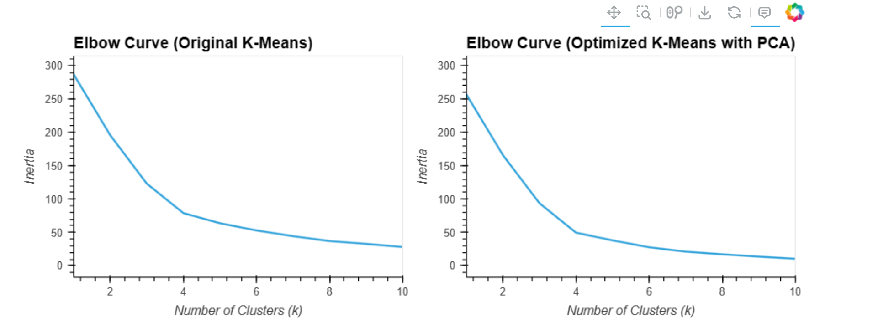

## Cryptocurrency Clustering

### Predicting Cryptocurrency Trends through Unsupervised Learning


#### Contents

1. [Overview](#overview)
2. [Files and Directories](#files-and-directories)
3. [Project Development Stages](#project-development-stages)
4. [Set Up and Execution](#set-up-and-execution)
5. [Ethical Considerations](#ethical-considerations)
6. [Data Source](#data-source)
7. [Code Source](#code-source)
8. [License](#license)
9. [Summary](#summary)
10. [Author](#author)

---

## 1. Overview

Cryptocurrency markets are dynamic, and predicting their trends is crucial for investors. In this project, I leverage unsupervised learning, specifically K-Means clustering, to predict cryptocurrency trends based on 24-hour or 7-day price changes. The project involves data preprocessing, feature scaling, cluster analysis, and visualisation of the results.

---

## 2. Files and Directories

- `crypto_market_data.csv`: Original dataset.
- `Crypto_Clustering.ipynb`: Jupyter notebook for cryptocurrency clustering.

---

## 3. Project Development Stages

i. **Data Loading and Exploration:**
   - Load cryptocurrency market data from `crypto_market_data.csv`.
   - Explore and plot summary statistics to understand the data.

ii. **Data Preprocessing:**
   - Use `StandardScaler()` from scikit-learn to normalize the data.
   - Create a DataFrame with scaled data, setting "coin_id" as the index.

iii. **Cluster Analysis - Original Data:**
   - Apply the elbow method to find optimal clusters (k).
   - Cluster cryptocurrencies using K-Means with the best k value.
   - Visualize the clusters using an interactive scatter plot with hvPlot.

iv. **Principal Component Analysis (PCA):**
   - Perform PCA on the original scaled data to reduce features to three principal components.
   - Evaluate explained variance to understand information retention.

v. **Cluster Analysis - PCA Data:**
   - Apply the elbow method to find the optimal k for PCA data.
   - Cluster cryptocurrencies using K-Means on PCA data.
   - Visualize the results using an interactive scatter plot.

---

## 4. Set Up and Execution

1. Clone the repository to your local machine:
   ```bash
   git clone https://github.com/your-username/CryptoClustering.git
   cd CryptoClusterin
   
---  

## 5. Ethical Considerations

A publicly available dataset containing no personal information or harmful content. The source has been duly credited. Visualizations are original, and the code is publicly available, promoting transparency.

---
## 6. Data Source

The dataset was generated by edX Boot Camps LLC, and is intended for educational purposes only.


---

## 7. Code Source

Parts of our code were adapted from the documentation of the libraries used, such as:

- HoloViews documentation
- Pandas documentation
- Scikit-learn documentation
---
## 8. License

This project is open-source and is made available under the terms of the MIT License. The MIT License is a permissive open-source license allowing you to use, modify, and distribute this software. For the full details of the MIT License, please refer to [MIT License](https://choosealicense.com/licenses/mit/).

---

## 9. Summary

The project uses unsupervised learning techniques to cluster cryptocurrencies based on price changes. Two approaches are explored: clustering on original data and clustering after dimensionality reduction using PCA. The results are visualized for comparison, providing insights into the impact of feature reduction on clustering.

---
## 10. Author

- Godswill Anyasor
- [GitHub Repository](https://github.com/AnyasorG/CryptoClustering.git)
---
